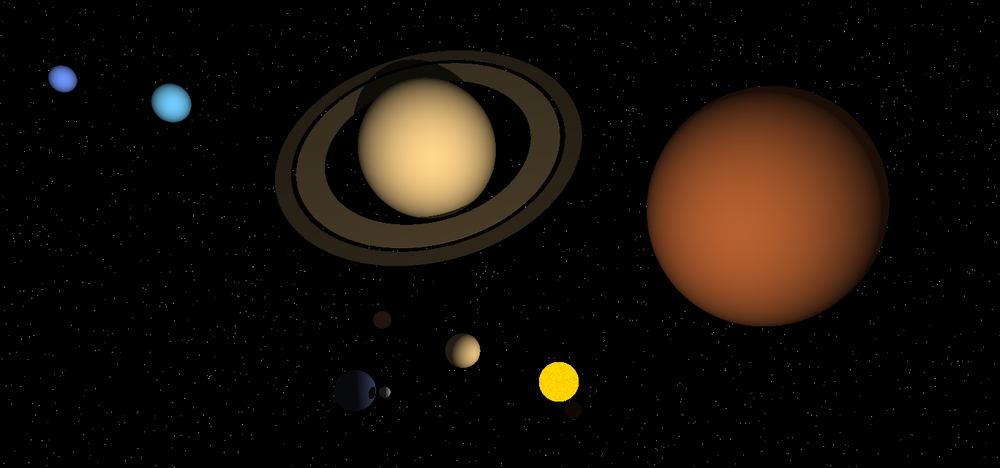

## Représentation du système solaire par synthèse d'images en 3D

Ce projet a été réalisé dans le cadre du cours "3D dynamique pour le web" de la licence professionnelle.  
Le cours était une introduction à la synthèse d'images en 2D et 3D pour le web à travers l'utilisation détournée de shaders et celle de la plateforme web [Shadertoy](https://www.shadertoy.com/).

Un projet sur un thème libre devait être réalisé et reprendre les concepts développés en cours :
- **fonctions de distance signées**, leur union, intersection et soustraction, transformations linéaires de celles-ci (rotation, translation)
- **lancer de rayons**, animation de la caméra, multiplicité de rayons
- **shading** : modèle de Phong
- **textures** : bruit de Perlin

Une base de code était fournie pour l'algorithme de lancer de rayons et les fonctions aléatoires (chaque emprunt est mentionné dans le code du projet).

J'ai choisi de réaliser un système solaire simplifié en 3D reposant sur le lancer de rayons. Dans celui-ci :
- les objets célestes représentés sont des sphères obtenues grâce à la fonction de distance signée correspondante, les planètes ont un mouvement de rotation autour du soleil, la Lune autour de la Terre
- la Terre sert de référence au système, les dimensions des autres planètes (rayon, distance au soleil, durée de révolution) sont déduites à partir de données réelles
- les proportions entre rayon des planètes et distances de celles-ci au soleil ne sont pas respectées (c'est impossible)
- la texture du soleil est obtenue à l'aide d'un bruit fractal oscillant entre le jaune et l'orange pour un rendu crédible. Sa taille est volontairement réduite en raison des problèmes de proportion mentionnés
- la couleur des planètes est obtenue à l'aide d'une couleur initiale représentative et l'application d'un modèle de Phong modifié (pas de terme spéculaire)
- le lancer d'un deuxième rayon à partir d'une planète (atteinte par un rayon tiré depuis la caméra) vers le soleil permet de porter des ombres et d'illustrer les éclipses
- la scène peut être tournée par un clic maintenu et déplacement latéral de la souris

Le rapport fourni dans le dépôt détaille l'obtention de l'ensemble des éléments graphiques représentés et leur dynamique : soleil, planètes, leur couleur et leur mouvement, anneaux de Saturne, Lune, cratères de Mars, ombre, étoiles au loin.

Le projet peut être consulté (code et rendu) à l'adresse https://www.shadertoy.com/view/cdtXz4.
